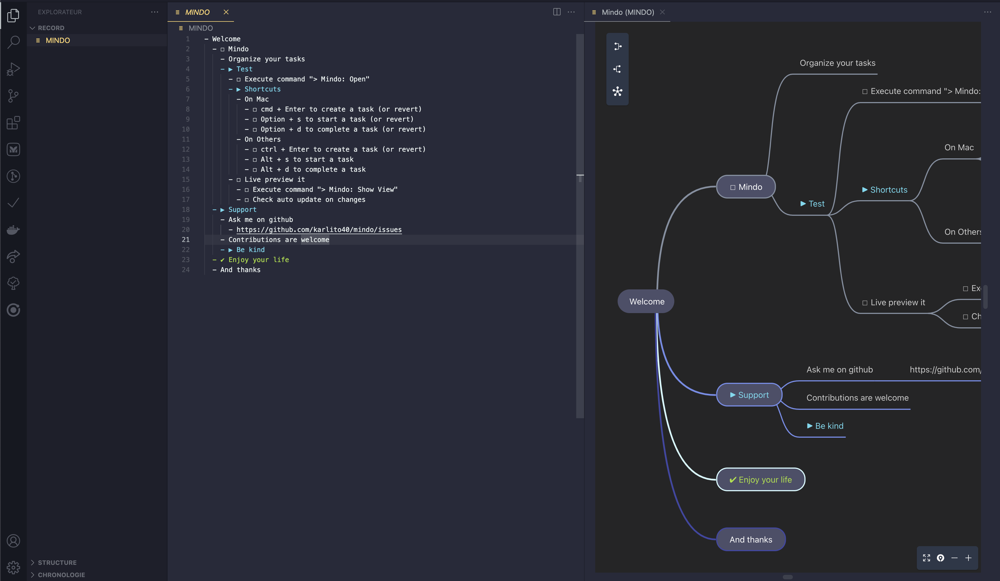

# Mindo

Organize your to-dos using a mind map file


## Features

- **Portable**: Mindmaps are handle through a simple plain text format. Make it easy to update their content for anyone
- **Fast management**: Shortcuts let you change a task's status directly within the file 
- **Multiple**:  Create as many as Mindo file as you want
- **Visual**: Mindmaps views are update in real time
- **Exportable**: Export the generated mind map to SVG

## Tutorial

You can create a mindo project using the command
```
> Mindo: Open
```
Or by creating it manually. In this case you have 2 options:
- create a file name `MINDO`
- create a file using the `.mindo` extension

Next open the preview using
```
> Mindo: Show View
```

Update your file following Mindo format as described below. 
And deep dive in our shortcut section to ease your task management.

### Format 

A mindo file follows some rules.

Use those symbols to create specific nodes:
- `-` + `your text`: Generate a simple node text with _your text_ as label. Use it as additional information for example
- `- ☐` + `your text`: Generate an idle task node with _your text_ as label
- `- ▶` + `your text`: Geneate a started task node with _your text_ as label
- `- ✔` + `your text`: Generate a completed task node with _your text_ as label

**Children nodes** used **2 spaces** indentation more than their parents.

**Working example**
```
- Welcome
  - ☐ Mindo
    - Organize your tasks
    - ▶ Test
      - ☐ Execute command "> Mindo: Open"
      - ▶ Shortcuts
        - On Mac
          - ☐ cmd + Enter to create a task (or revert)
          - ☐ Option + s to start a task (or revert)
          - ☐ Option + d to complete a task (or revert)
        - On Others
          - ☐ ctrl + Enter to create a task (or revert)
          - ☐ Alt + s to start a task
          - ☐ Alt + d to complete a task
      - ☐ Live preview it
        - ☐ Execute command "> Mindo: Show View"
        - ☐ Check auto update on changes
  - ▶ Support
    - Ask me on github
      - https://github.com/karlito40/mindo/issues
    - Contributions are welcome
    - ▶ Be kind
  - ✔ Enjoy your life
  - And thanks
```

### Commands & shortcuts

It adds 5 commands to the command palette:

```js
'Mindo: Open' // Open or create your main project's mindo file
'Mindo: Show View' // Open the mindmap visualizer on the focus editor
'Mindo: Toggle Task' // Create a task or transform it into a simple label
'Mindo: Toggle Start' // Toggle started symbol
'Mindo: Toggle Done' // Toggle done symbol
```

It adds 4 shortcuts when editing a `Mindo` file:

```js
'Cmd/Ctrl+Enter' // Triggers `Mindo: Toggle Task`
'Alt+Enter' // Triggers `Mindo: Toggle Task`
'Alt+D' // Triggers `Mindo: Toggle Done`
'Alt+S' // Triggers `Mindo: Toggle Start`
```

## Demo



## Support

Don't hesitate to fill an issue on github [https://github.com/karlito40/mindo/issues](https://github.com/karlito40/mindo/issues). I will try my best to help.

## Release Notes

- **0.1.0** Add SVG export and force dark theme
- **0.0.0** Initial release 

---

## Final

**Thanks & Enjoy!**

_Hope it serves you well as it does for me_